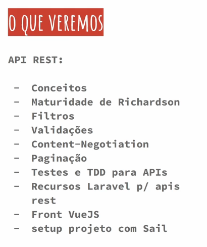
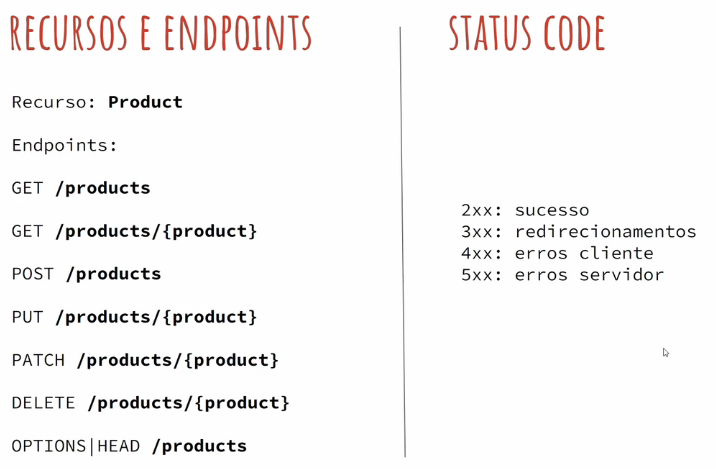
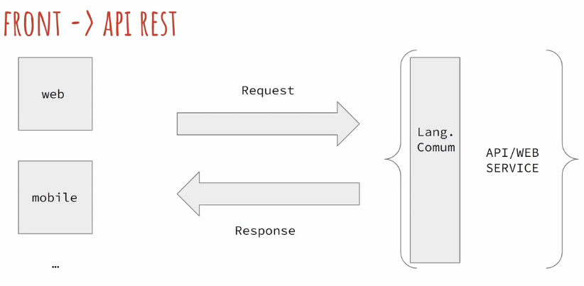

# Laravel API REST com Vue JS

https://codeexperts.com.br/

## <a name="indice">Índice</a>

1. [Iniciando Bloco 3](#parte1)
2. [01 - Introdução](#parte2)
3. [02 - O Que Veremos no Bloco](#parte3)
4. [03- API X WebService](#parte4)
5. [04 - Recursos, Endpoints e Mais](#parte5)
6. [05 - Visão do Esquema API](#parte6)
7. [06 - Como será o trabalho no Bloco](#parte7)
8. [07 - Ambientando Sail](#parte8)
9. [08 - Conslusões](#parte9)
10. [Nossa Primeira API REST](#parte10)
11. [09 - Iniciando Projeto](#parte11)
12. [10 - Explorando Arquivos API](#parte12)
13. [11 - Iniciando API REST](#parte13)
14. [12 - Criando Recursos](#parte14)
15. [13 - Atualizando Recursos](#parte15)
16. [14 - Apagando Recursos](#parte16)
17. [15 - Interagindo com os Endpoints](#parte17)
18. [16 - Conclusões](#parte18)
19. [EXTRA: Adendos API REST Laravel 11](#parte19)
20. [Recursos para API](#parte20)
21. [17 - Introdução](#parte21)
22. [18 - Entendendo Lógica de Serialização](#parte22)
23. [19 - Modificando e Apendando Atributos Model](#parte23)
24. [20 - Hidden e Visible Atributos](#parte24)
25. [21 - Serializando Datas e Formatando](#parte25)
26. [22 - Relação Produtos e Categorias](#parte26)
27. [23 - REST Dados Relacionados](#parte27)
28. [24 - Eager Loading Global Model](#parte28)
29. [25 - API Resources](#parte29)
30. [26 - API Resources Collections](#parte30)
31. [27 - API Errors Handler](#parte31)
32. [28 - Conclusões](#parte32)
33. [Sanctum: API Tokens Backend](#parte33)
34. [29 - Introdução](#parte34)
35. [30 - Configs Sanctum](#parte35)
36. [31 - Autenticando Usuários](#parte36)
37. [32 - Autorização nos Endpoints](#parte37)
38. [33 - Removendo Tokens](#parte38)
39. [34 - Permissões nos Tokens](#parte39)
40. [35 - Conclusões](#parte40)
41. [Testes de Software Laravel](#parte41)
42. [36 - Introdução](#parte42)
43. [37 - Testes no Laravel](#parte43)
44. [38 - Nossa Primeira Classe de Teste](#parte44)
45. [39 - Testando Endpoint GET /products](#parte45)
46. [40 - Mais Assertions JSON](#parte46)
47. [41 - Testando GET /products/id](#parte47)
48. [42 - Testando Não Autorizado POST /products](#parte48)
49. [43 - Testando Criação de Produtos](#parte49)
50. [44 - Testando Endpoint PUT /products/id](#parte50)
51. [45 - Testando Endpoint DELETE /products/id](#parte51)
52. [46 - Testando Validação no POST](#parte52)
53. [47 - Asserts para Conteúdo da Validação](#parte53)
54. [48 - Testando Validação no PUT Produto](#parte54)
55. [49 - Testes Upload Fotos Produto](#parte55)
56. [50 - Testes Fotos Associadas a Produto](#parte56)
57. [51 - Testes Validação Fotos](#parte57)
58. [52 - Continuando Validação Imagens](#parte58)
59. [53 - Autorização Endpoint Fotos](#parte59)
60. [54 - Testando Listagem Fotos Produto](#parte60)
61. [55 - Testando Remoção Foto Produto](#parte61)
62. [56 - Testando Categorias Produto Endpoint](#parte62)
63. [57 - Testando Paginação Produtos](#parte63)
64. [58 - Conclusões](#parte64)
65. [Front com VueJS - Autenticação](#parte65)
66. [59 - Introdução](#parte66)
67. [60 - Iniciando Projeto Vue](#parte67)
68. [61 - Configurando VS Code para Vue](#parte68)
69. [62 - Conhecendo Estrutura Projeto](#parte69)
70. [63 - Instalando TailwindCSS](#parte70)
71. [64 - Instalando AXIOS HTTP](#parte71)
72. [65 - Criando Componente Login](#parte72)
73. [66 - Componente Login 2](#parte73)
74. [67 - Trabalhando com Dados Componente Vue](#parte74)
75. [68 - Realizando Autenticação API](#parte75)
76. [69 - Chamada a Endpoints sob Auth](#parte76)
77. [70 - Serviço para HTTP Client](#parte77)
78. [71 - Persistindo Token](#parte78)
79. [72 - Logout e Mais](#parte79)
80. [73 - Before Route Enter - Router](#parte80)
81. [74 - Ponderações VueJS](#parte81)
82. [75 - Config Backend Sanctum SPA](#parte82)
83. [76 - Config Frontend Sanctum SPA](#parte83)
84. [77 - Ponderações Token & SPAs](#parte84)
85. [78 - Conclusões](#parte85)
86. [Gerenciando Estado com Pinia](#parte86)
87. [79 - Introdução](#parte87)
88. [80 - O Pinia](#parte88)
89. [81 - Melhorias HttpClient](#parte89)
90. [82 - Store: Auth](#parte90)
91. [83 - Usando Auth Store](#parte91)
92. [84 - Persistindo Estado do Pinia](#parte92)
93. [85 - Adicionando Interceptors HttpClient](#parte93)
94. [86 - Conclusões](#parte94)
95. [Vue: Gerenciamento de Produtos](#parte95)
96. [87 - Introdução](#parte96)
97. [88 - Organizando Tela de Login](#parte97)
98. [89 - Rotas Aninhadas para Layout Admin](#parte98)
99. [90 - Listagem dos Produtos](#parte99)
100. [91 - Criação do Produto](#parte100)
101. [92 - Edição do Produto](#parte101)
102. [93 - Atualizando Produto](#parte102)
103. [94 - Linkando Edit e Delete na Tabela](#parte103)
104. [95 - Removendo Produto](#parte104)
105. [96 - Corrigindo Carregamento Edit Produto](#parte105)
106. [97 - Iniciando Paginação dos Produtos Painel](#parte106)
107. [98 - Concluindo Paginação](#parte107)
108. [99 - Iniciando Upload de Fotos](#parte108)
109. [100 - Processando Upload](#parte109)
110. [101 - Concluindo Upload](#parte110)
111. [102 - Componente List Fotos](#parte111)
112. [103 - Dinamizando Listagem de Fotos](#parte112)
113. [104 - Removendo Imagens](#parte113)
114. [105 - Conclusões Módulo](#parte114)
115. [Atualizando Laravel, V 11](#parte115)
116. [106 - Introdução](#parte116)
117. [107 - Atualizando Sail](#parte117)
118. [108 - Dependências Laravel 11](#parte118)
119. [109 - Corrigindo Conflitos e Concluindo Update](#parte119)
120. [110 - Mais Detalhes Upgrade Guide](#parte120)
121. [111 - Testando com Front & Concluindo](#parte121)
122. [Front Loja, Filtros & Ajustes](#parte122)
123. [112 - Introdução Módulo](#parte123)
124. [113 - Questões Lista Produtos Admin](#parte124)
125. [114 - Add Mais Info Produto Resource](#parte125)
126. [115 - Add Slug em Produtos](#parte126)
127. [116 - Adequando Testes Endpoint Produtos](#parte127)
128. [117 - Corrigindo Testes Produto Endpoint](#parte128)
129. [118 - Testes & Criando Endpoint Home Loja](#parte129)
130. [119 - Front Home Loja VueJS](#parte130)
131. [120 - Front Loja pt2](#parte131)
132. [121 - Add Testes para Exibição de Thumb na Home](#parte132)
---


## <a name="parte1">1 - Iniciando Bloco 3</a>


[Voltar ao Índice](#indice)

---


## <a name="parte2">2 - 01 - Introdução</a>



[Voltar ao Índice](#indice)

---


## <a name="parte3">3 - 02 - O Que Veremos no Bloco</a>


[Voltar ao Índice](#indice)

---


## <a name="parte4">4 - 03- API X WebService</a>



[Voltar ao Índice](#indice)

---


## <a name="parte5">5 - 04 - Recursos, Endpoints e Mais</a>


[Voltar ao Índice](#indice)

---


## <a name="parte6">6 - 05 - Visão do Esquema API</a>



[Voltar ao Índice](#indice)

---


## <a name="parte7">7 - 06 - Como será o trabalho no Bloco</a>


[Voltar ao Índice](#indice)

---


## <a name="parte8">8 - 07 - Ambientando Sail</a>


[Voltar ao Índice](#indice)

---


## <a name="parte9">9 - 08 - Conslusões</a>


[Voltar ao Índice](#indice)

---


## <a name="parte10">10 - Nossa Primeira API REST</a>


[Voltar ao Índice](#indice)

---


## <a name="parte11">11 - 09 - Iniciando Projeto</a>


[Voltar ao Índice](#indice)

---


## <a name="parte12">12 - 10 - Explorando Arquivos API</a>

[proj01](proj01)

[Voltar ao Índice](#indice)

---


## <a name="parte13">13 - 11 - Iniciando API REST</a>

```
 sail artisan make:model Product -mf                                                                                                                                                                                                                                                                                                       1 ↵ josemalcher@j0z3M4lch3r 

   INFO  Model [app/Models/Product.php] created successfully.

   INFO  Factory [database/factories/ProductFactory.php] created successfully.

   INFO  Migration [database/migrations/2025_07_22_222748_create_products_table.php] created successfully.  

```

[Voltar ao Índice](#indice)

---


## <a name="parte14">14 - 12 - Criando Recursos</a>


[Voltar ao Índice](#indice)

---


## <a name="parte15">15 - 13 - Atualizando Recursos</a>


[Voltar ao Índice](#indice)

---


## <a name="parte16">16 - 14 - Apagando Recursos</a>

```
 sail artisan make:controller API/ProductController -r --api                                                                                                                                                                                                                                                                                   josemalcher@j0z3M4lch3r 

   INFO  Controller [app/Http/Controllers/API/ProductController.php] created successfully.

```


[Voltar ao Índice](#indice)

---


## <a name="parte17">17 - 15 - Interagindo com os Endpoints</a>


[Voltar ao Índice](#indice)

---


## <a name="parte18">18 - 16 - Conclusões</a>


[Voltar ao Índice](#indice)

---


## <a name="parte19">19 - EXTRA: Adendos API REST Laravel 11</a>


[Voltar ao Índice](#indice)

---


## <a name="parte20">20 - Recursos para API</a>


[Voltar ao Índice](#indice)

---


## <a name="parte21">21 - 17 - Introdução</a>


[Voltar ao Índice](#indice)

---


## <a name="parte22">22 - 18 - Entendendo Lógica de Serialização</a>


[Voltar ao Índice](#indice)

---


## <a name="parte23">23 - 19 - Modificando e Apendando Atributos Model</a>

```php
class Product extends Model
{
    /** @use HasFactory<\Database\Factories\ProductFactory> */
    use HasFactory;

    protected $fillable = ['name', 'price'];

    // protected $guarded = []; // permite tudo

/*    public  function price():Attribute
    {
        return new Attribute(
            get: fn($price) => $price / 100
        );
    }*/
    protected $appends = ['price_float'];
    protected function priceFloat(): Attribute
    {
        return new Attribute(
            get: fn ($price, $attributes) => $attributes['price'] / 100,
        );
    }
```

[Voltar ao Índice](#indice)

---


## <a name="parte24">24 - 20 - Hidden e Visible Atributos</a>


[Voltar ao Índice](#indice)

---


## <a name="parte25">25 - 21 - Serializando Datas e Formatando</a>

```php
<?php

class Product extends Model
{
    protected $casts = [
        'created_at' => 'date:d-m-Y',
    ];
//    protected function serializeDate(DateTimeInterface $date)
//    {
//        return $date->format('Y-m-d H:i:s');
//    }
}

```

[Voltar ao Índice](#indice)

---


## <a name="parte26">26 - 22 - Relação Produtos e Categorias</a>


[Voltar ao Índice](#indice)

---


## <a name="parte27">27 - 23 - REST Dados Relacionados</a>

```php
class ProductController extends Controller
{
    public function show(Product $product)
    {
        // Earger Loading | Lazy Loading
        //return $product->with('categories')->first();
        return $product->load('categories');
        //return $product;
    }
```


[Voltar ao Índice](#indice)

---


## <a name="parte28">28 - 24 - Eager Loading Global Model</a>

```php
class Product extends Model
{
    protected $with = ['categories'];
```

```php
class ProductController extends Controller
{
    public function show(Product $product)
    {
        // Earger Loading | Lazy Loading
        // return $product->load('categories');
        //return $product->with('categories')->first();
        return $product->without('categories')->find($product->id);
    }

```


[Voltar ao Índice](#indice)

---


## <a name="parte29">29 - 25 - API Resources</a>

```
sail artisan make:resource ProductResource                                                                                                                                                                           josemalcher@j0z3M4lch3r 

   INFO  Resource [app/Http/Resources/ProductResource.php] created successfully.

```

```php
class ProductResource extends JsonResource
{
    // public static $wrap = 'product';

    /**
     * Transform the resource into an array.
     *
     * @return array<string, mixed>
     */
    public function toArray(Request $request): array
    {
        // return parent::toArray($request);
        return [
            'name' => $this->name,
            'price' => $this->price,
            'price_float' => $this->price_float,
            'categories' => $this->whenLoaded('categories'),

        ];

    }
```

```php
public function show(Product $product)
    {
        return new ProductResource($product->load('categories')); ;
    }
```

[Voltar ao Índice](#indice)

---


## <a name="parte30">30 - 26 - API Resources Collections</a>

```
sail artisan make:resource ProductCollectionResource --collection                                                                                                                                                    josemalcher@j0z3M4lch3r 

   INFO  Resource collection [app/Http/Resources/ProductCollectionResource.php] created successfully.

```

```php
class ProductCollectionResource extends ResourceCollection
{
    /**
     * Transform the resource collection into an array.
     *
     * @return array<int|string, mixed>
     */
    public function toArray(Request $request): array
    {
        return parent::toArray($request);
        /*return [
            'product' => $this->collection,
            'outro' => 'TESTE',

        ];*/
    }
```

```php
    public function index()
    {
        // return new ProductCollectionResource($this->product->all());
        return new ProductCollectionResource($this->product->paginate(10));
    }

```


[Voltar ao Índice](#indice)

---


## <a name="parte31">31 - 27 - API Errors Handler</a>

```php
<?php

use Symfony\Component\HttpKernel\Exception\NotFoundHttpException;
use Illuminate\Http\Request;
use Illuminate\Foundation\Application;
use Illuminate\Foundation\Configuration\Exceptions;
use Illuminate\Foundation\Configuration\Middleware;

return Application::configure(basePath: dirname(__DIR__))
    ->withRouting(
        web: __DIR__.'/../routes/web.php',
        api: __DIR__.'/../routes/api.php',
        commands: __DIR__.'/../routes/console.php',
        health: '/up',
    )
    ->withMiddleware(function (Middleware $middleware): void {
        //
    })
    ->withExceptions(function (Exceptions $exceptions): void {

        // dd('O código chegou aqui!'); // ADICIONE ESTA LINHA DE TESTE
        $exceptions->render(function (Throwable $e, Request $request) {

            // Verifica se a requisição é para a API e se a exceção é do tipo NotFoundHttpException
            if ($request->is('api/*') && $e instanceof NotFoundHttpException) {
                return response()->json([
                    'error' => true,
                    'message' => 'O registro solicitado não foi encontrado.'
                ], 404);
            }

            // Para todas as outras exceções, continua o comportamento padrão
            return parent::render($request, $e);
        });

    })->create();

```

```
 sail artisan make:exception ApiRuleException                                                                                                                                                                         josemalcher@j0z3M4lch3r 

   INFO  Exception [app/Exceptions/ApiRuleException.php] created successfully.

```


[Voltar ao Índice](#indice)

---


## <a name="parte32">32 - 28 - Conclusões</a>


[Voltar ao Índice](#indice)

---


## <a name="parte33">33 - Sanctum: API Tokens Backend</a>


[Voltar ao Índice](#indice)

---


## <a name="parte34">34 - 29 - Introdução</a>


[Voltar ao Índice](#indice)

---


## <a name="parte35">35 - 30 - Configs Sanctum</a>


[Voltar ao Índice](#indice)

---


## <a name="parte36">36 - 31 - Autenticando Usuários</a>

```
sail artisan make:controller API/AuthController                                                                                                                                                                  1 ↵ josemalcher@j0z3M4lch3r 

   INFO  Controller [app/Http/Controllers/API/AuthController.php] created successfully.
```

[Voltar ao Índice](#indice)

---


## <a name="parte37">37 - 32 - Autorização nos Endpoints</a>

```php


Route::apiResource('products', ProductController::class)
    ->only(['index']);
Route::apiResource('products', ProductController::class)
    ->only(['store', 'update', 'destroy'])->middleware('auth:sanctum');
```

[Voltar ao Índice](#indice)

---


## <a name="parte38">38 - 33 - Removendo Tokens</a>

```php
    public function logout()
    {
        auth()->user()->tokens()->delete();
        //auth()->user()->tokens()->where('token', '!=', '')->delete(); // remove todos existentes
        return response()->json([],204);
    }
```


[Voltar ao Índice](#indice)

---


## <a name="parte39">39 - 34 - Permissões nos Tokens</a>

```php
public function login(Request $request)
    {
        $credecial = $request->only(['email', 'password']);

        if(!auth()->attempt($credecial)) abort(401, 'Invalid credentials');

        return response()->json([
            'data' => [
                'token' => auth()->user()->createToken('default', ['update']),

            ]
        ]);
    }
```

```php
public function update(Request $request, Product $product)
    {
        if(!$request->user()->tokenCan('update')) abort(401, 'Unauthorized');

        $product->update($request->all());
        return $product;
    }
```

[Voltar ao Índice](#indice)

---


## <a name="parte40">40 - 35 - Conclusões</a>


[Voltar ao Índice](#indice)

---


## <a name="parte41">41 - Testes de Software Laravel</a>


[Voltar ao Índice](#indice)

---


## <a name="parte42">42 - 36 - Introdução</a>


[Voltar ao Índice](#indice)

---


## <a name="parte43">43 - 37 - Testes no Laravel</a>

```
        <env name="DB_CONNECTION" value="sqlite"/>
        <env name="DB_DATABASE" value=":memory:"/>
```

```
 sail artisan test                                                                                                                          josemalcher@j0z3M4lch3r

   PASS  Tests\Unit\ExampleTest
  ✓ that true is true                                                                                                                                                                                                 0.01s  

   PASS  Tests\Feature\ExampleTest
  ✓ the application returns a successful response                                                                                                                                                                     0.15s  

  Tests:    2 passed (2 assertions)
  Duration: 0.24s

```

```
» sail artisan test --filter=unit                                                                                                            josemalcher@j0z3M4lch3r

   PASS  Tests\Unit\ExampleTest
  ✓ that true is true

  Tests:    1 passed (1 assertions)
  Duration: 0.04s
```

[Voltar ao Índice](#indice)

---


## <a name="parte44">44 - 38 - Nossa Primeira Classe de Teste</a>


[Voltar ao Índice](#indice)

---


## <a name="parte45">45 - 39 - Testando Endpoint GET /products</a>


[Voltar ao Índice](#indice)

---


## <a name="parte46">46 - 40 - Mais Assertions JSON</a>


[Voltar ao Índice](#indice)

---


## <a name="parte47">47 - 41 - Testando GET /products/id</a>


[Voltar ao Índice](#indice)

---


## <a name="parte48">48 - 42 - Testando Não Autorizado POST /products</a>


[Voltar ao Índice](#indice)

---


## <a name="parte49">49 - 43 - Testando Criação de Produtos</a>


[Voltar ao Índice](#indice)

---


## <a name="parte50">50 - 44 - Testando Endpoint PUT /products/id</a>


[Voltar ao Índice](#indice)

---


## <a name="parte51">51 - 45 - Testando Endpoint DELETE /products/id</a>


[Voltar ao Índice](#indice)

---


## <a name="parte52">52 - 46 - Testando Validação no POST</a>


[Voltar ao Índice](#indice)

---


## <a name="parte53">53 - 47 - Asserts para Conteúdo da Validação</a>


[Voltar ao Índice](#indice)

---


## <a name="parte54">54 - 48 - Testando Validação no PUT Produto</a>


[Voltar ao Índice](#indice)

---


## <a name="parte55">55 - 49 - Testes Upload Fotos Produto</a>


[Voltar ao Índice](#indice)

---


## <a name="parte56">56 - 50 - Testes Fotos Associadas a Produto</a>


[Voltar ao Índice](#indice)

---


## <a name="parte57">57 - 51 - Testes Validação Fotos</a>


[Voltar ao Índice](#indice)

---


## <a name="parte58">58 - 52 - Continuando Validação Imagens</a>


[Voltar ao Índice](#indice)

---


## <a name="parte59">59 - 53 - Autorização Endpoint Fotos</a>


[Voltar ao Índice](#indice)

---


## <a name="parte60">60 - 54 - Testando Listagem Fotos Produto</a>


[Voltar ao Índice](#indice)

---


## <a name="parte61">61 - 55 - Testando Remoção Foto Produto</a>


[Voltar ao Índice](#indice)

---


## <a name="parte62">62 - 56 - Testando Categorias Produto Endpoint</a>


[Voltar ao Índice](#indice)

---


## <a name="parte63">63 - 57 - Testando Paginação Produtos</a>


[Voltar ao Índice](#indice)

---


## <a name="parte64">64 - 58 - Conclusões</a>


[Voltar ao Índice](#indice)

---


## <a name="parte65">65 - Front com VueJS - Autenticação</a>


[Voltar ao Índice](#indice)

---


## <a name="parte66">66 - 59 - Introdução</a>


[Voltar ao Índice](#indice)

---


## <a name="parte67">67 - 60 - Iniciando Projeto Vue</a>


[Voltar ao Índice](#indice)

---


## <a name="parte68">68 - 61 - Configurando VS Code para Vue</a>


[Voltar ao Índice](#indice)

---


## <a name="parte69">69 - 62 - Conhecendo Estrutura Projeto</a>


[Voltar ao Índice](#indice)

---


## <a name="parte70">70 - 63 - Instalando TailwindCSS</a>


[Voltar ao Índice](#indice)

---


## <a name="parte71">71 - 64 - Instalando AXIOS HTTP</a>


[Voltar ao Índice](#indice)

---


## <a name="parte72">72 - 65 - Criando Componente Login</a>


[Voltar ao Índice](#indice)

---


## <a name="parte73">73 - 66 - Componente Login 2</a>


[Voltar ao Índice](#indice)

---


## <a name="parte74">74 - 67 - Trabalhando com Dados Componente Vue</a>


[Voltar ao Índice](#indice)

---


## <a name="parte75">75 - 68 - Realizando Autenticação API</a>


[Voltar ao Índice](#indice)

---


## <a name="parte76">76 - 69 - Chamada a Endpoints sob Auth</a>


[Voltar ao Índice](#indice)

---


## <a name="parte77">77 - 70 - Serviço para HTTP Client</a>


[Voltar ao Índice](#indice)

---


## <a name="parte78">78 - 71 - Persistindo Token</a>


[Voltar ao Índice](#indice)

---


## <a name="parte79">79 - 72 - Logout e Mais</a>


[Voltar ao Índice](#indice)

---


## <a name="parte80">80 - 73 - Before Route Enter - Router</a>


[Voltar ao Índice](#indice)

---


## <a name="parte81">81 - 74 - Ponderações VueJS</a>


[Voltar ao Índice](#indice)

---


## <a name="parte82">82 - 75 - Config Backend Sanctum SPA</a>


[Voltar ao Índice](#indice)

---


## <a name="parte83">83 - 76 - Config Frontend Sanctum SPA</a>


[Voltar ao Índice](#indice)

---


## <a name="parte84">84 - 77 - Ponderações Token & SPAs</a>


[Voltar ao Índice](#indice)

---


## <a name="parte85">85 - 78 - Conclusões</a>


[Voltar ao Índice](#indice)

---


## <a name="parte86">86 - Gerenciando Estado com Pinia</a>


[Voltar ao Índice](#indice)

---


## <a name="parte87">87 - 79 - Introdução</a>


[Voltar ao Índice](#indice)

---


## <a name="parte88">88 - 80 - O Pinia</a>


[Voltar ao Índice](#indice)

---


## <a name="parte89">89 - 81 - Melhorias HttpClient</a>


[Voltar ao Índice](#indice)

---


## <a name="parte90">90 - 82 - Store: Auth</a>


[Voltar ao Índice](#indice)

---


## <a name="parte91">91 - 83 - Usando Auth Store</a>


[Voltar ao Índice](#indice)

---


## <a name="parte92">92 - 84 - Persistindo Estado do Pinia</a>


[Voltar ao Índice](#indice)

---


## <a name="parte93">93 - 85 - Adicionando Interceptors HttpClient</a>


[Voltar ao Índice](#indice)

---


## <a name="parte94">94 - 86 - Conclusões</a>


[Voltar ao Índice](#indice)

---


## <a name="parte95">95 - Vue: Gerenciamento de Produtos</a>


[Voltar ao Índice](#indice)

---


## <a name="parte96">96 - 87 - Introdução</a>


[Voltar ao Índice](#indice)

---


## <a name="parte97">97 - 88 - Organizando Tela de Login</a>


[Voltar ao Índice](#indice)

---


## <a name="parte98">98 - 89 - Rotas Aninhadas para Layout Admin</a>


[Voltar ao Índice](#indice)

---


## <a name="parte99">99 - 90 - Listagem dos Produtos</a>


[Voltar ao Índice](#indice)

---


## <a name="parte100">100 - 91 - Criação do Produto</a>


[Voltar ao Índice](#indice)

---


## <a name="parte101">101 - 92 - Edição do Produto</a>


[Voltar ao Índice](#indice)

---


## <a name="parte102">102 - 93 - Atualizando Produto</a>


[Voltar ao Índice](#indice)

---


## <a name="parte103">103 - 94 - Linkando Edit e Delete na Tabela</a>


[Voltar ao Índice](#indice)

---


## <a name="parte104">104 - 95 - Removendo Produto</a>


[Voltar ao Índice](#indice)

---


## <a name="parte105">105 - 96 - Corrigindo Carregamento Edit Produto</a>


[Voltar ao Índice](#indice)

---


## <a name="parte106">106 - 97 - Iniciando Paginação dos Produtos Painel</a>


[Voltar ao Índice](#indice)

---


## <a name="parte107">107 - 98 - Concluindo Paginação</a>


[Voltar ao Índice](#indice)

---


## <a name="parte108">108 - 99 - Iniciando Upload de Fotos</a>


[Voltar ao Índice](#indice)

---


## <a name="parte109">109 - 100 - Processando Upload</a>


[Voltar ao Índice](#indice)

---


## <a name="parte110">110 - 101 - Concluindo Upload</a>


[Voltar ao Índice](#indice)

---


## <a name="parte111">111 - 102 - Componente List Fotos</a>


[Voltar ao Índice](#indice)

---


## <a name="parte112">112 - 103 - Dinamizando Listagem de Fotos</a>


[Voltar ao Índice](#indice)

---


## <a name="parte113">113 - 104 - Removendo Imagens</a>


[Voltar ao Índice](#indice)

---


## <a name="parte114">114 - 105 - Conclusões Módulo</a>


[Voltar ao Índice](#indice)

---


## <a name="parte115">115 - Atualizando Laravel, V 11</a>


[Voltar ao Índice](#indice)

---


## <a name="parte116">116 - 106 - Introdução</a>


[Voltar ao Índice](#indice)

---


## <a name="parte117">117 - 107 - Atualizando Sail</a>


[Voltar ao Índice](#indice)

---


## <a name="parte118">118 - 108 - Dependências Laravel 11</a>


[Voltar ao Índice](#indice)

---


## <a name="parte119">119 - 109 - Corrigindo Conflitos e Concluindo Update</a>


[Voltar ao Índice](#indice)

---


## <a name="parte120">120 - 110 - Mais Detalhes Upgrade Guide</a>


[Voltar ao Índice](#indice)

---


## <a name="parte121">121 - 111 - Testando com Front & Concluindo</a>


[Voltar ao Índice](#indice)

---


## <a name="parte122">122 - Front Loja, Filtros & Ajustes</a>


[Voltar ao Índice](#indice)

---


## <a name="parte123">123 - 112 - Introdução Módulo</a>


[Voltar ao Índice](#indice)

---


## <a name="parte124">124 - 113 - Questões Lista Produtos Admin</a>


[Voltar ao Índice](#indice)

---


## <a name="parte125">125 - 114 - Add Mais Info Produto Resource</a>


[Voltar ao Índice](#indice)

---


## <a name="parte126">126 - 115 - Add Slug em Produtos</a>


[Voltar ao Índice](#indice)

---


## <a name="parte127">127 - 116 - Adequando Testes Endpoint Produtos</a>


[Voltar ao Índice](#indice)

---


## <a name="parte128">128 - 117 - Corrigindo Testes Produto Endpoint</a>


[Voltar ao Índice](#indice)

---


## <a name="parte129">129 - 118 - Testes & Criando Endpoint Home Loja</a>


[Voltar ao Índice](#indice)

---


## <a name="parte130">130 - 119 - Front Home Loja VueJS</a>


[Voltar ao Índice](#indice)

---


## <a name="parte131">131 - 120 - Front Loja pt2</a>


[Voltar ao Índice](#indice)

---


## <a name="parte132">132 - 121 - Add Testes para Exibição de Thumb na Home</a>


[Voltar ao Índice](#indice)

---

